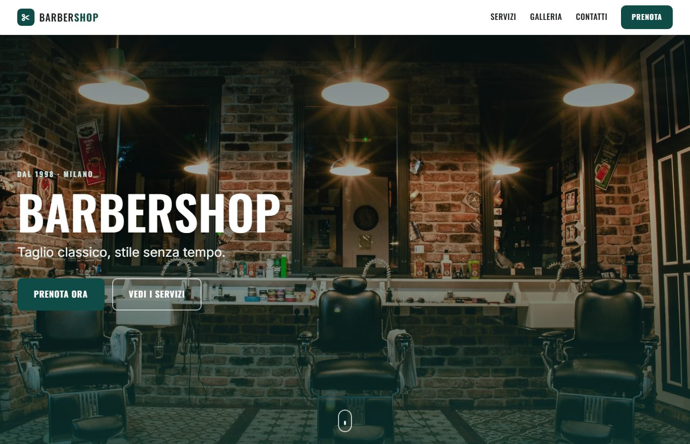
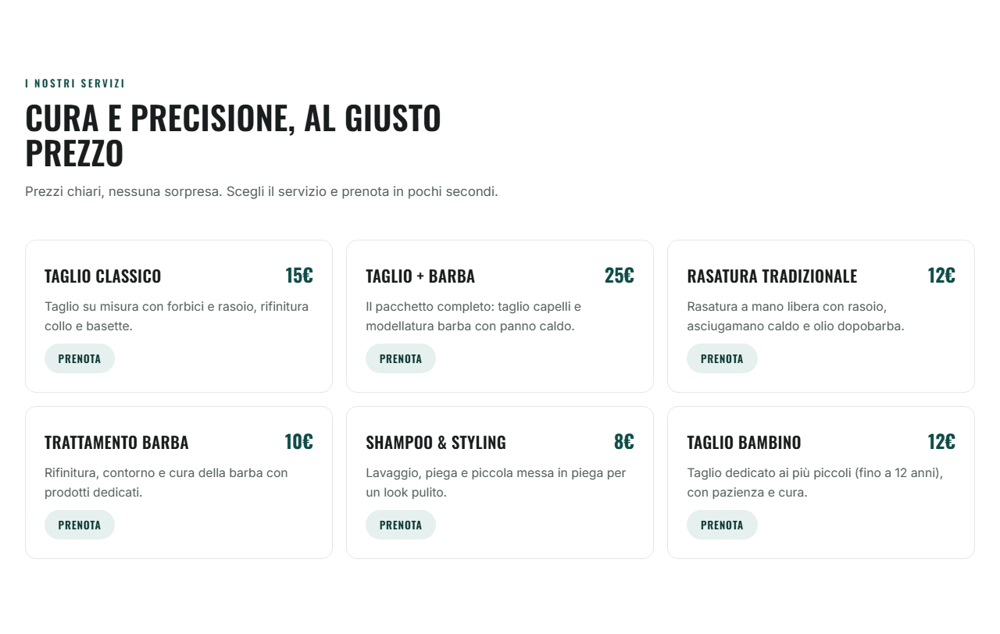
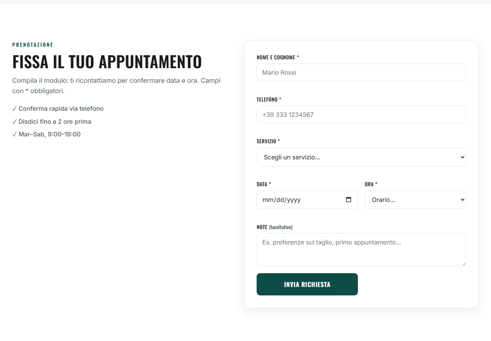
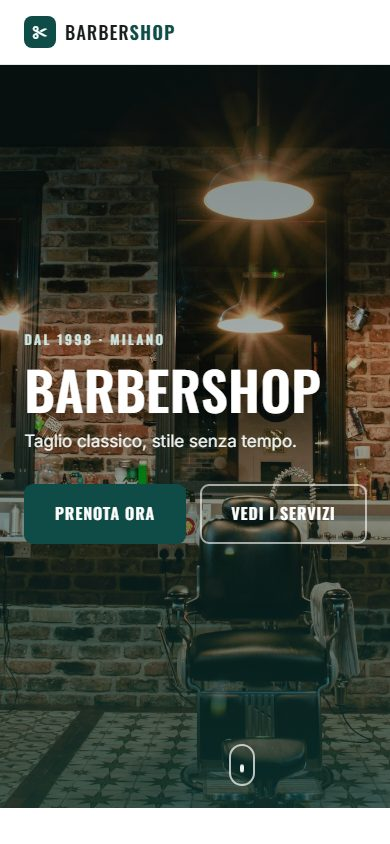

# Barbershop — Landing Page

A one-page landing site for a classic men's barbershop. Modern, clean,
**mobile-first**, built with plain HTML, CSS and JavaScript — **no frameworks,
no dependencies, no build step**.

> ⚠️ **Portfolio demo project.** Not a real business: name, address, phone and
> VAT number are plausible placeholders. The site content is in Italian (its
> intended audience); this README is in English.

## 📸 Preview



| Services | Booking form |
|---|---|
|  |  |




## ✨ Features
- **True mobile-first**: the base layout targets phones, desktop is progressive
  enhancement via media queries.
- **Full-width hero** with an environment photo and a booking CTA.
- **Services** with prices; the "Book" button pre-fills the chosen service in
  the form.
- **Responsive gallery** with hover zoom.
- **Booking form** with client-side validation (name, phone, service, date and
  time — no past dates, no closing days).
- **Custom cursor**, subtle (desktop with a mouse only).
- Light scroll-reveal animations that respect `prefers-reduced-motion`.
- **Accessibility-minded**: visible focus, `aria-*` attributes, success message
  with `role="status"`.

## 🛠️ Stack
HTML5 · CSS3 (custom properties, mobile-first) · vanilla JavaScript.
Fonts: [Oswald](https://fonts.google.com/specimen/Oswald) +
[Inter](https://fonts.google.com/specimen/Inter) (Google Fonts).

## 📁 Structure
```
.
├─ index.html        # the whole page
├─ css/style.css     # styles, mobile-first
├─ js/main.js        # mobile menu, scroll reveal, form validation, custom cursor
├─ img/              # images (hero + gallery)
│  └─ screenshots/   # preview images used in this README
└─ favicon.svg
```

## ▶️ Run locally
It's a static site, so just open `index.html` in your browser.
Or serve it with a small local server:
```bash
python -m http.server 5500
# then open http://localhost:5500
```

## 🖼️ Image credits
Photos from [Unsplash](https://unsplash.com), used under their license.

## 📄 License
Demo / portfolio project.
